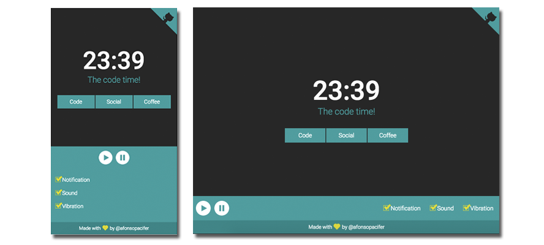

# React Pomodoro

> Pomodoro timer for developers.

## Features


- Times available
  - Timer for code - 25min
  - Timer for social - 5min
  - Timer for Coffee - 15min
- Alarms available
  - Web Notifications
  - Vibration
  - Songs
- Play button
- Pause button

## Versioning

To keep better organization of releases we follow the [Semantic Versioning 2.0.0](http://semver.org/) guidelines.

## Run the project locally

**1 -** Prepare the environment:

```sh
$ npm install -g webpack
```

**2 -** Clone the project and install the dependencies:

```sh
$ git clone https://github.com/afonsopacifer/react-pomodoro.git
$ cd react-pomodoro
$ npm install
```
**3 -** Run webpack and webpack-dev-server:

```sh
$ npm start
```

Go to: [localhost:8080](http://localhost:8080/)

## Contributing
Find on our [issues](https://github.com/afonsopacifer/react-pomodoro/issues/) the next steps of the project ;)
<br>
Want to contribute? [Follow these recommendations](https://github.com/afonsopacifer/react-pomodoro/blob/master/CONTRIBUTING.md).

## History
See [Releases](https://github.com/afonsopacifer/react-pomodoro/releases) for detailed changelog.

## License
[MIT License](https://github.com/afonsopacifer/react-pomodoro/blob/master/LICENSE.md) © [Afonso Pacifer](http://afonsopacifer.com/)
